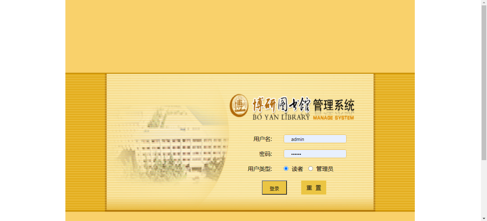
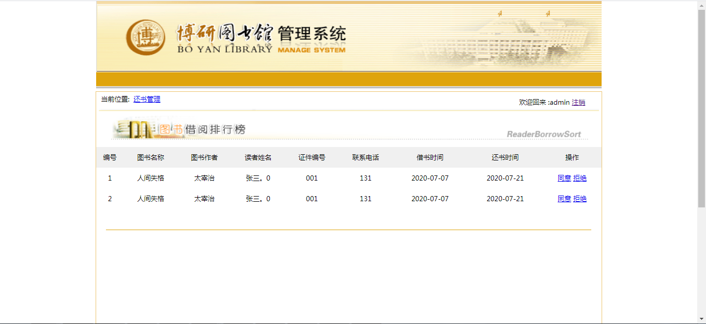
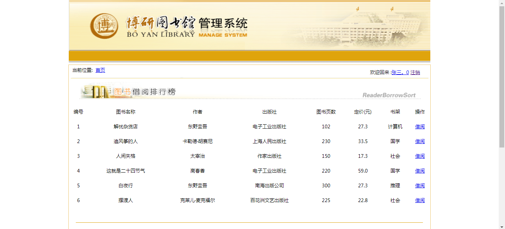
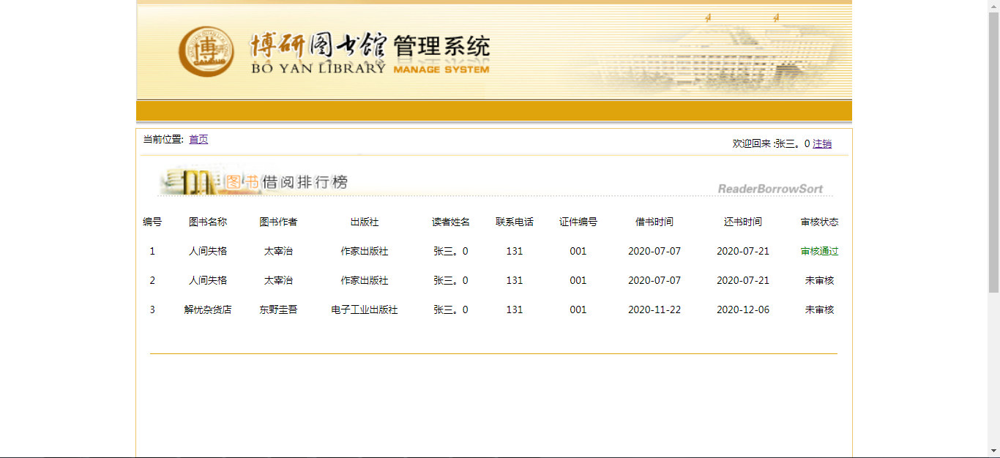

<h1 align="center">图书馆管理系统</h1>

## 简介
图书馆管理系统：角色分为管理员、读者；用户登录界面、图书借阅排行榜、还书管理、书籍管理、借阅记录、用户管理、统计分析功能。    --计算机毕业设计源码；毕设源码；java毕业设计源码

## 联系方式

<h3 align="center">获取完整代码与数据库文件 + 微信：deepguan QQ: 86050149 QQ群: 783742310</h3>

<h3 align="center">可帮忙远程部署 包运行成功！提供远程部署、修改代码、设计文档指导、代码讲解等服务！</h3>

## 功能介绍（完整见运行截图）
管理员：登录与身份验证，书籍管理（添加、删除、修改、查找），借阅和归还管理（审批借阅与还书请求），用户管理（注册、更新、删除读者信息），统计分析（生成借阅统计报表以了解图书馆运营状况）。

读者：登录与身份验证，浏览和搜索图书目录，查看图书详情及借阅排行榜，借阅书籍，并查看个人借阅记录与还书信息，更新个人信息以便更好地个性化服务。

## 运行截图

本代码来源于网络,仅供学习参考使用!

